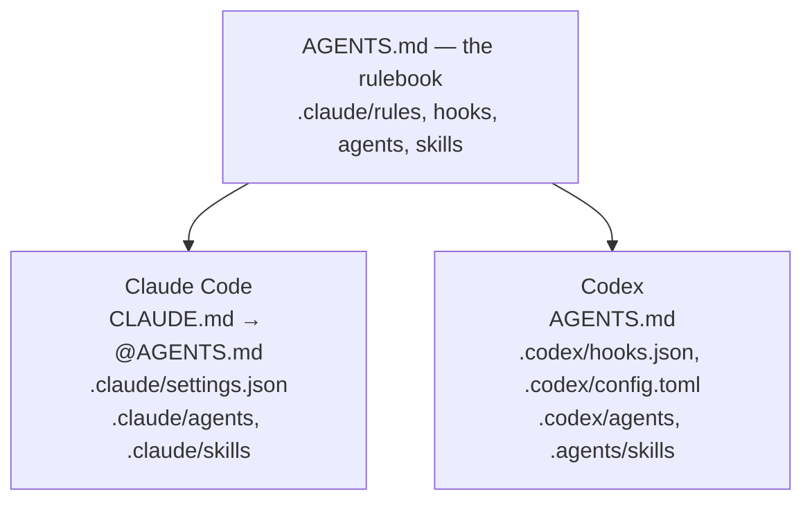

# create-agent-rig

**Rig configures a repository for reliable AI-assisted development with Claude
Code and Codex — and keeps that configuration safe to upgrade and remove.**

- **One configuration, both harnesses.** One rulebook, one set of guards and
  review agents, wired natively into Claude Code _and_ Codex.
- **Upgrades that respect your changes.** Files you edited are reported, not
  overwritten. Files you deleted stay deleted.
- **Guardrails that run, not just rules that are read.** Hooks refuse a
  pre-commit bypass, a force-push to a shared branch or a credential written
  into a file.
- **Optional integrations, done by the book.** Figma and Atlassian MCP wiring,
  and GitHub Spec Kit through its own pinned CLI.
- **A clean exit.** `doctor` shows what is installed and healthy; `uninstall`
  removes only what Rig can prove it wrote.

Rig configures agent harnesses. It does not generate application code, run
agents, or install plugins.

## Quick start

```sh
# a new repository
npx create-agent-rig@latest my-project
cd my-project

# …or an existing one
cd your-repo
npx create-agent-rig@latest init --dry-run   # show what would be written
npx create-agent-rig@latest init
```

Then open the repository in either harness — nothing else to configure:

```sh
claude    # Claude Code reads CLAUDE.md and .claude/settings.json
codex     # Codex reads AGENTS.md, .codex/ and .agents/skills/
```

Check it and commit it:

```sh
npx create-agent-rig@latest doctor
git add -A && git commit -m "Add agent rig"
```

Commit `.claude/.rig-manifest.json` with everything else — it is how later
upgrades tell your changes from Rig's.

Everything is written inside the repository; Rig changes no global Claude Code
or Codex configuration. The only machine-level file it can write is the
optional Memory registration described [below](#memory); Spec Kit setup also
fills uv's download cache.

After generation or upgrade, review the checked-in `.codex/hooks.json` in
Codex's `/hooks` view and explicitly trust it if Codex asks. The
[official Codex hooks documentation](https://learn.chatgpt.com/docs/hooks)
records trust against the current hook hash, so a changed hook definition may
require that review again; Rig never silently replaces hook configuration you
own.

## Why Rig

Agent instructions tend to rot. A `CLAUDE.md` copied between projects, a
separate set of Codex notes, hooks pasted from a blog post — each drifts on its
own, and none of it can be upgraded without overwriting what the team changed
since.

Rig treats that configuration as something with an owner and a lifecycle:

| Without Rig                                         | With Rig                                                  |
| --------------------------------------------------- | --------------------------------------------------------- |
| Separate Claude Code and Codex setups               | One rulebook, projected into each harness's native format |
| Rules that only work if the agent reads them        | Hooks that refuse the dangerous action at the tool layer  |
| Upgrading means re-copying and losing local changes | `upgrade` updates untouched files and reports the rest    |
| A deleted rule quietly comes back                   | Deleted stays deleted                                     |
| No way to tell what is installed or broken          | `doctor`                                                  |
| Removal is guesswork                                | `uninstall` removes only files Rig can prove it wrote     |

## Claude Code and Codex



`AGENTS.md` is the canonical rulebook. `CLAUDE.md` is a short shim that imports
it, so both harnesses read the same rules. The hook scripts live once in
`.claude/hooks/` and are wired by both `.claude/settings.json` and
`.codex/hooks.json`. Review agents and skills are projected into each harness's
own format.

The harnesses are not identical, and Rig does not pretend they are. Two hooks —
the subagent model guard and the routing warning — exist only for Claude Code.
MCP wiring goes into Claude Code's `.mcp.json` entry by entry, but into Codex's
`.codex/config.toml` as a whole file Rig renders.

## What Rig installs

| Area               | What you get                                                                                                                                                        |
| ------------------ | ------------------------------------------------------------------------------------------------------------------------------------------------------------------- |
| Rules              | `AGENTS.md`, `CLAUDE.md` and `.claude/rules/`: autonomy tiers (what an agent may do alone), stop rules, TDD workflow and a Definition of Done                       |
| Guards             | Hooks that refuse bypassing pre-commit, force-pushing a shared branch, destructive `rm`, writing credentials, and ending a session while a configured check is red  |
| Agents             | `test-writer` and `implementation-agent` for the TDD steps; `code-reviewer`, `security-scanner` and `prose-reviewer` for review — each pinned to a model and effort |
| Skills             | `worktree-task`, `new-invariant`, `check-premises` and `skill-authoring`                                                                                            |
| Lifecycle metadata | `.claude/.rig-manifest.json`: which bytes Rig installed                                                                                                             |

A guard is a check on each edit or command before it runs, not a sandbox. Each
one states what it does not catch in its own header — `guard-secret-file`, for
example, sees what an agent writes through its edit tools, not a file committed
from disk.

Two things are left for you, and the installed `AGENTS.md` says so: the
commands your Definition of Done should run (`.claude/hooks/dod-checks.json`),
and the paths in your project that need a human reviewer.

An **experimental** workflow layer adds a queue-driven autonomous loop, a
pre-merge gate skill and PR-lifecycle helpers. It is opt-in:
`init --layer workflow`.

## How ownership works

Rig remembers exactly which bytes it installed. That lets every lifecycle
command tell Rig's files from yours:

| The file is…                | `upgrade`                    | `uninstall`    |
| --------------------------- | ---------------------------- | -------------- |
| exactly as Rig installed it | updated to the new release   | removed        |
| edited by you               | kept, reported as a conflict | kept, reported |
| deleted by you              | stays deleted                | nothing to do  |
| not Rig's, or there before  | never claimed                | never touched  |

Conflicts are reported with the path to the new version, so you can compare
and merge yourself — Rig does no automatic merging of the documents your agents
obey. The details, including how line endings and hook wiring are handled, are
in [`docs/command-contract.md`](docs/command-contract.md) and
[`docs/decisions/raw-byte-ownership.md`](docs/decisions/raw-byte-ownership.md).

## Lifecycle

**Upgrade** to the current release:

```sh
npx create-agent-rig@latest upgrade --dry-run   # the plan, nothing written
npx create-agent-rig@latest upgrade             # the plan, then asks before writing
npx create-agent-rig@latest upgrade --yes       # no prompt (required off a terminal)
```

**Diagnose** the repository:

```sh
npx create-agent-rig@latest doctor
npx create-agent-rig@latest doctor --json
```

`doctor` checks the Rig manifest and the files it lists, the installed guards,
the optional workflow layer, integration wiring, Spec Kit's own offline status
and the Memory registration. It exits `1` only when a check fails. It reports
wiring, not reachability: it never contacts a provider, and never claims that
authorization, connectivity or trust were verified.

**Uninstall**, keeping everything you wrote:

```sh
npx create-agent-rig@latest uninstall --dry-run
npx create-agent-rig@latest uninstall
```

Only files whose bytes still match what Rig installed are removed. Anything
edited is kept and listed, and the manifest stays until nothing of Rig's is
left. `--detach` removes the manifest anyway and hands the kept files over to
you. Integration wiring is removed with `setup remove`, not `uninstall`.

## Optional integrations

`setup` adds integrations after showing the exact plan and asking for
consent. It works in a repository where Rig is installed:

```sh
npx create-agent-rig@latest setup                  # interactive: pick provider and harness
npx create-agent-rig@latest setup list
npx create-agent-rig@latest setup add figma-mcp --harness claude-code --harness codex
npx create-agent-rig@latest setup apply            # re-apply everything declared
npx create-agent-rig@latest setup remove figma-mcp
```

`add`, `apply` and `remove` accept `--dry-run`. With `--json` they never
prompt, and write only with `--yes`. Intent and ownership are recorded in `.rig/integrations.json`.

| Integration     | ID              | What Rig does                                                                               |
| --------------- | --------------- | ------------------------------------------------------------------------------------------- |
| Figma MCP       | `figma-mcp`     | Writes the hosted MCP entry for Claude Code and/or Codex                                    |
| Atlassian MCP   | `atlassian-mcp` | Same, for Atlassian's hosted MCP                                                            |
| Basic Memory    | `basic-memory`  | Preview. Wires `uvx basic-memory mcp`; never installs, reads or removes Basic Memory's data |
| GitHub Spec Kit | `spec-kit`      | Runs Spec Kit's own pinned CLI (1.0.8) to set up Claude Code and Codex                      |

**MCP wiring is owned by Rig.** Rig writes the entries and removes only the ones
it can prove it wrote; your own MCP entries are preserved. Signing in to a
provider happens in the harness — Rig stores no credentials.

**Spec Kit is owned by Spec Kit.** Rig runs the official `specify` CLI at a
pinned version through `uvx` — so `uv`, `uvx` and `git` are required — and
Spec Kit creates, upgrades and removes its own files. Rig never copies or
deletes them. The first setup needs a clean working tree and never re-runs
`init` on an already initialized repository; an existing installation is
adopted with `setup add spec-kit --adopt`.

**Plugins are not managed.** Rig 0.10.0 has no plugin manager or marketplace.
Claude Code and Codex plugins can be used alongside Rig as usual.

## Memory

Memory is a separate project with its own releases. Rig does not include it,
does not need it, and never searches for it. If you use Memory, register it
once per machine; Rig then passes `doctor` and `load` through to it after a
version handshake:

```sh
npx create-agent-rig@latest setup --memory-root <memory-checkout>
npx create-agent-rig@latest memory doctor --json
npx create-agent-rig@latest memory load --json --cwd .
```

The registration is written to `~/.config/create-agent-rig/subsystems.json`
(`%APPDATA%\create-agent-rig\` on Windows). A Memory with an incompatible
contract version is refused with exit code `4`. The boundary is described in
[`docs/decisions/memory-rig-boundary.md`](docs/decisions/memory-rig-boundary.md).

## Safe by default

- **Ownership, not guesswork.** Rig changes or removes only files whose bytes
  match what it installed.
- **Conflicts over overwrites.** Your edits are reported, never merged or
  replaced.
- **Deleted stays deleted.** An upgrade does not restore what you removed.
- **Plan first.** `--dry-run` shows the plan for `init`, `upgrade`, `uninstall`
  and `setup`; `upgrade`, `uninstall` and `setup` also ask before writing.
- **Bounded external processes.** Spec Kit runs with a fixed argument list, a
  deadline, and cleanup of its whole process tree.
- **No stored credentials.** Rig does not put provider credentials in the
  repository, its state files or its output.

## Platform support

| Platform | Status for 0.10.0                                                      |
| -------- | ---------------------------------------------------------------------- |
| Linux    | Supported — the packed release is accepted on the exact release commit |
| Windows  | Supported — same acceptance; one Spec Kit limitation below             |
| macOS    | Supported on Apple silicon — same acceptance                           |

On Windows, Spec Kit 1.0.8 rewrites `.claude/settings.json` and
`.codex/config.toml` with CRLF line endings. `doctor` then reports Rig's files
with a warning, and where a Codex MCP integration is also wired, a later change
to it asks you to merge the Codex config by hand instead of overwriting it.

## Limitations and non-goals

- No application scaffolding, no project templates to choose from.
- Not an agent runtime, scheduler or workflow engine; it configures the
  harnesses you already run.
- No plugin manager, and no bundled memory engine.
- Provider accounts, authorization and connectivity are between you, the
  provider and the harness.
- The workflow layer is experimental.

## The 2-minute demo

From a clone of this repository:

```sh
./demo.sh
```

It installs the rig into a scratch directory and shows a hook refusing an
attempted pre-commit bypass.

## Requirements

- Node ≥ 20. The CLI has no runtime dependencies.
- Git.
- For Spec Kit only: `uv` and `uvx`.

## Documentation

| Document                                               | Covers                                                                |
| ------------------------------------------------------ | --------------------------------------------------------------------- |
| [`docs/command-contract.md`](docs/command-contract.md) | Every command's options, output, exit codes and ownership rules       |
| [`CHANGELOG.md`](CHANGELOG.md)                         | What changed in each release, and the release checklist               |
| [`docs/decisions/`](docs/decisions/)                   | Design decisions: ownership, `AGENTS.md`, Codex adapter, integrations |
| [`docs/compatibility.md`](docs/compatibility.md)       | What each capability does per harness and platform                    |
| [`docs/releasing.md`](docs/releasing.md)               | How a release is prepared and accepted                                |

## Development

```sh
pnpm install
pnpm test          # build and the full suite
pnpm test:unit     # the fast suite
pnpm lint
pnpm typecheck
```

This repository uses its own rig: changes go through a branch, tests first, and
review before merge. [`AGENTS.md`](AGENTS.md) is the working agreement.

## License

[MIT](LICENSE)
